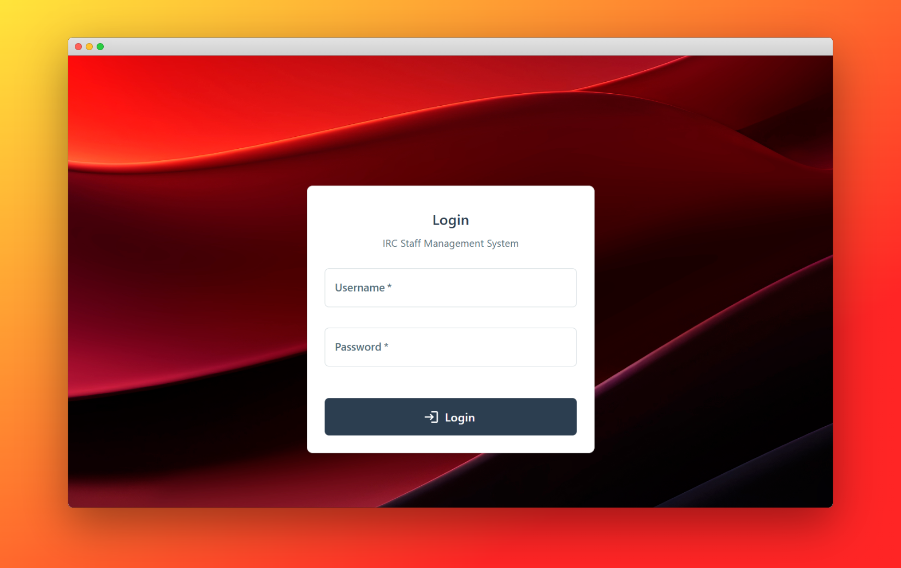
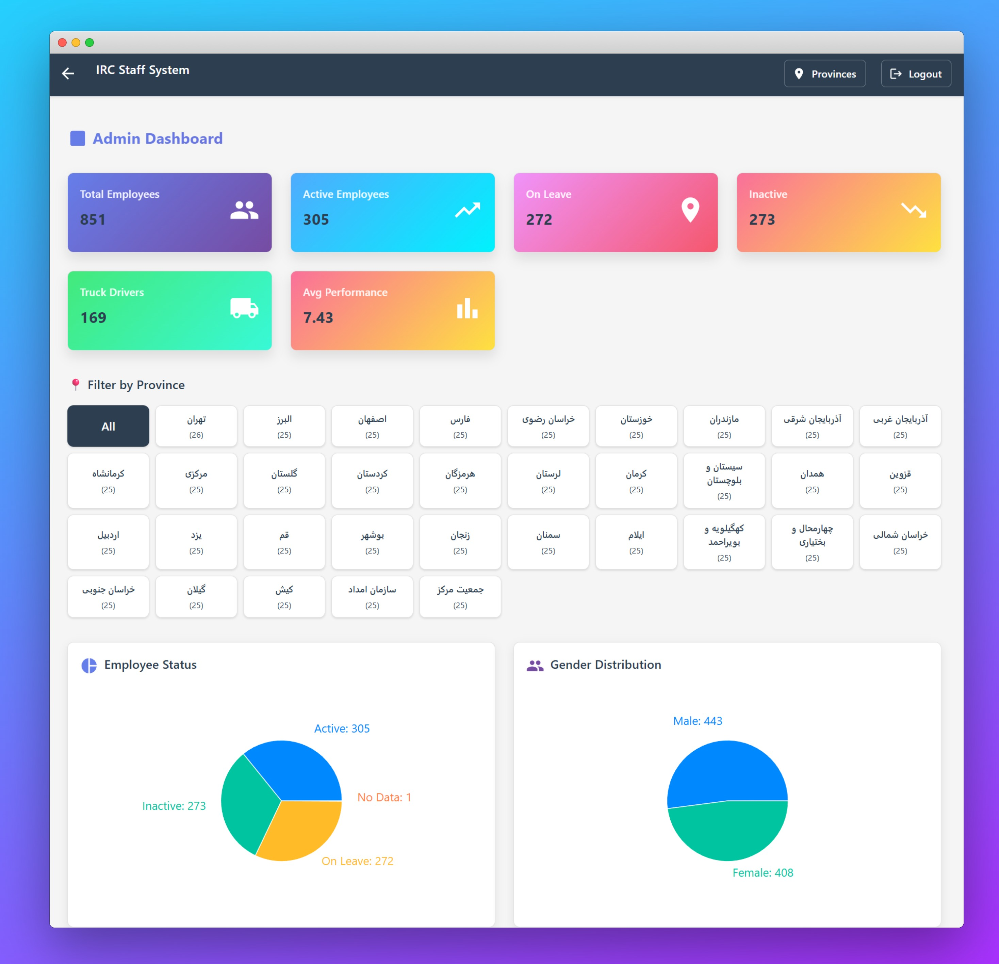
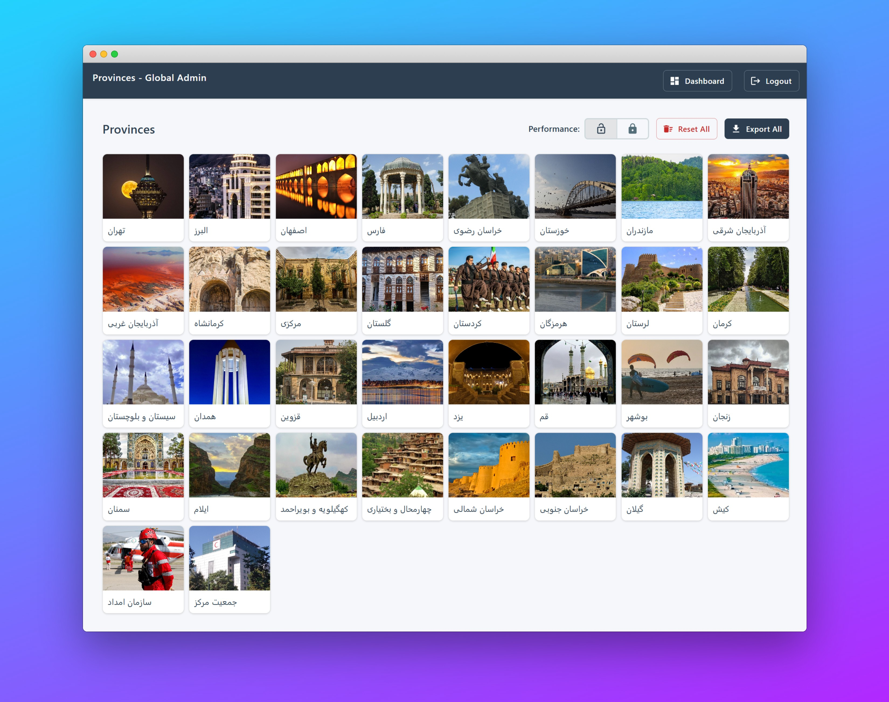
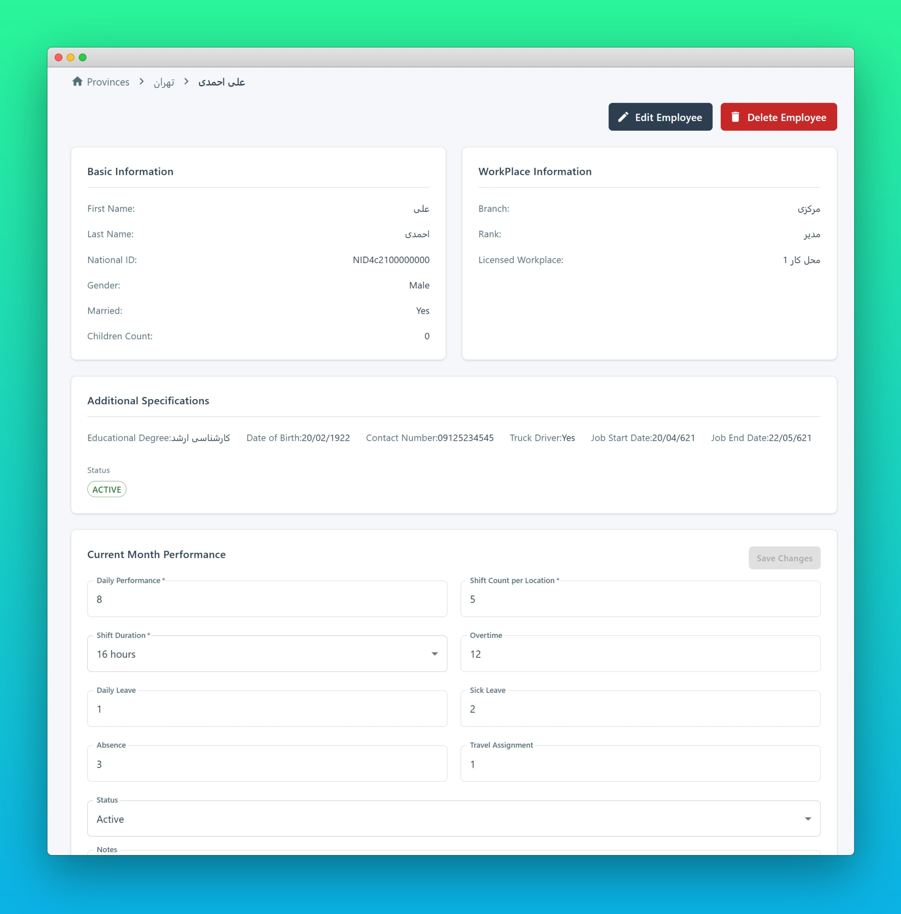

# IRC Employee Management System

A lightweight, role‑based employee management system designed for organizations with a **Global Admin** and fixed **Province Admins**.  
The system provides a clean separation of access, scoped data visibility, and a simple front‑end flow.

---

## 📸 Screenshots

Below are some screenshots of the IRC Employee Management System in action:

<div align="center">

<b>Login Page</b><br>


<b>Global Admin Dashboard</b><br>


<b>Province List</b><br>


<b>Province Dashboard</b><br>


<b>Employee List</b><br>


<b>Employee Details</b><br>


<b>Edit Employee Dialog</b><br>


<b>New Employee Form</b><br>


<b>Performance Lock Warning</b><br>


</div>

## 📦 Repository layout

The project is organized as a pnpm workspace with two sub‑projects:

```
.
├── client/                 # React + Vite front‑end
│   ├── public/
│   ├── src/
│   ├── package.json
│   └── …
├── server/                 # Express + TypeORM back‑end
│   ├── src/
│   ├── jest.config.js
│   └── …
├── PERFORMANCE_LOCK_*.md   # design notes for the performance‑lock feature
├── routing.md              # api routing notes
└── README.md               # you are here
```

## �️ Tech Stack

**Backend**

- Node.js + Express + TypeScript
- MongoDB with TypeORM
- Session-based authentication
- Jest for unit/integration tests

**Frontend**

- React 18 + TypeScript + Vite
- Material-UI (MUI) v5
- React Router + Axios
- ESLint/Prettier configured via `eslint.config.js`

---

## 🔧 Getting started

### Prerequisites

- Node.js 18+ (or LTS)
- pnpm (see https://pnpm.io/)
- MongoDB instance (local or remote)

### Installation

Clone the repository and install dependencies from the root:

```sh
git clone <repo-url>
cd IRC-StaffSystem
pnpm install
```

This will install packages for both `client` and `server`.

### Environment

Create a `.env` file in `server/` with at least:

```env
PORT=4000
MONGO_URI=mongodb://localhost:27017/irc-staff
SESSION_SECRET=super-secret
```

The client does not require environment variables for basic development; see `client/vite.config.ts` for the few that exist (`VITE_API_BASE`).

### Running the server

```sh
cd server
pnpm dev          # ts-node‑dev / nodemon – watches files
# or to build & start
pnpm build
pnpm start
```

The server listens on `http://localhost:4000` by default.

### Running the client

```sh
cd client
pnpm dev
```

Open http://localhost:5173 (or the port printed by Vite).

### Running both

From the repo root you can run the two concurrently with tools such as `concurrently`, or use two terminals:

```sh
pnpm --filter server dev
pnpm --filter client dev
```

The client is configured to proxy API requests to the server (`/api/*`), see `vite.config.ts`.

---

## �🚀 Overview

The system manages employees across multiple provinces.  
There are **only two roles**:

- **Global Admin** — can view all provinces and browse employees within any province.
- **Province Admin** — can only manage employees within _their own_ province.

Province admins themselves are **fixed** (not created through the UI or API).

---

## 🗂️ Core Features

- Secure login (`/auth/login`)
- Global Admin dashboard showing all provinces
- Province‑scoped employee management
- **Create, edit, delete employees** (province‑scoped)
- **Performance record management** (add, edit, delete)
- **Global Performance Lock** — Prevent all employees from editing performance records system-wide
- Fetch employees belonging to a selected province
- Material-UI frontend with custom theme
- No generic `/employees` root — everything is province‑scoped

---

## 🧩 API Structure

All employee data is nested under provinces.

### **Authentication**

| Method | Endpoint      | Description                             |
| ------ | ------------- | --------------------------------------- |
| POST   | `/auth/login` | Login as Global Admin or Province Admin |

---

## **🔹 Provinces**

| Method | Endpoint                 | Description                            |
| ------ | ------------------------ | -------------------------------------- |
| GET    | `/provinces`             | List all provinces (Global Admin only) |
| GET    | `/provinces/:provinceId` | Get details of a specific province     |

---

## **🔹 Global Settings**

| Method | Endpoint                                   | Description                                         |
| ------ | ------------------------------------------ | --------------------------------------------------- |
| GET    | `/global-settings`                         | Get global settings (performance lock status)       |
| POST   | `/global-settings/toggle-performance-lock` | Toggle performance editing lock (Global Admin only) |

---

## **🔹 Employees (Province‑Scoped)**

All employee operations must include the province they belong to.

| Method | Endpoint                                       | Description                           |
| ------ | ---------------------------------------------- | ------------------------------------- |
| GET    | `/provinces/:provinceId/employees`             | List all employees of the province    |
| POST   | `/provinces/:provinceId/employees`             | Create a new employee in the province |
| GET    | `/provinces/:provinceId/employees/:employeeId` | Fetch a single employee               |
| PUT    | `/provinces/:provinceId/employees/:employeeId` | Update an employee                    |
| DELETE | `/provinces/:provinceId/employees/:employeeId` | Delete an employee                    |

---

## 🧭 Front-End Flow

### **1. Login Page (`/`)**

- User enters credentials
- Sends POST → `/auth/login`
- Redirects based on role

---

### **2. Global Admin Flow**

**GlobalAdminDashboardPage**

Displays a list of all provinces (`GET /provinces`).

User selects a province → redirect to:

`/provinces/:provinceId/employees`

Which loads the employee list for that province.

---

### **3. Province Admin Flow**

**ProvinceEmployeesPage**

Displays all employees of their province:

`GET /provinces/:provinceId/employees`

Actions:

- "Create Employee" → `NewEmployeeFormPage`
- Select employee → `EmployeePage` (`/provinces/:provinceId/employees/:employeeId`)
- Edit employee → `EditEmployeeDialog` (modal)
- Manage performance → `PerformanceManager` component

---

## � Performance Lock Feature

The Global Admin can lock/unlock performance editing across the entire system.

### **How It Works**

1. **Locking**: Global Admin clicks the lock toggle on the dashboard
   - Sets `performanceLocked: true` in global settings
   - All employees receive HTTP 423 (Locked) when attempting to edit performance

2. **UI Feedback**:
   - Lock toggle button shows current state (🔒 locked / 🔓 unlocked)
   - Toast notification displays with distinct messages and colors:
     - **Warning (orange)**: "Performance editing is now LOCKED"
     - **Success (green)**: "Performance editing is now UNLOCKED"
   - Employees see alert when locked: "Performance records are currently locked. You cannot make changes at this time."

3. **Reset All** button is disabled when lock is active (prevents accidental resets during lock period)

### **Reset All Performances**

Global Admin can reset all employee performance metrics to defaults:

- **Preserved**: Employee status (remains unchanged)
- **Reset to defaults**:
  - Daily performance: 0
  - Shift count per location: 0
  - Shift duration: 8 hours
  - Overtime: 0
  - Daily leave: 0
  - Sick leave: 0
  - Absence: 0
  - Travel assignment: 0
  - Notes: cleared

### **API Response**

```json
{
	"success": true,
	"data": {
		"_id": "...",
		"performanceLocked": true,
		"lastLockedBy": "admin_user_id",
		"lockedAt": "2025-12-28T...",
		"createdAt": "...",
		"updatedAt": "..."
	}
}
```

---

## �📦 Data Model

### **User**

```
{
  id: string,
  email: string,
  password: string (hashed),
  role: "global" | "province",
  provinceId?: string
}
```

### **Province**

```
{
  id: string,
  name: string
}
```

### **Employee**

```
{
  id: string,
  firstName: string,
  lastName: string,
  phone: string,
  nationalId: string,
  provinceId: string
}
```

Employees always reference the province they belong to.

### **GlobalSettings**

```
{
  id: string,
  performanceLocked: boolean,
  lastLockedBy: string (user id),
  lockedAt: Date,
  createdAt: Date,
  updatedAt: Date
}
```

Stores system-wide settings including the performance lock status.

---

## 🎯 Design Principles

- **Minimalistic & strict**: no unnecessary endpoints
- **100% province‑scoped employees**
- **Global admin ≠ province admin list viewer**
- **Predictable URL structure**
- **Easy to port into any client framework**

---

## 📘 Summary

This system provides:

- Clean role‑based structure
- Simple routes
- Hierarchical API (`/provinces → employees`)
- No redundant admin management
- Production‑ready separation of access

Perfect for organizational employee management with fixed province administration.

---

## 🛠 Testing & linting

- **Server tests** live in `server/src/__tests__`; run with:

  ```sh
  cd server
  pnpm test
  ```

- **Client** currently has no automated tests – end‑to‑end tests may be added in the future.

- **Linting/formatting** (frontend) is enforced by running:

  ```sh
  cd client
  pnpm lint
  pnpm format
  ```

The `server` project uses TypeScript's `strict` mode and `eslint` is enabled via `npm run lint` inside `server`.

## 🧭 Development notes

- **Routing** is defined in `server/src/routes`; see `routing.md` for the decision‑making process.
- **Performance lock** logic lives in `server/src/controllers/globalSettingsController.ts` and is documented in `PERFORMANCE_LOCK_FEATURE.md`.
- Front‑end pages and components reside under `client/src/pages` and `client/src/components`; look for `GlobalAdminDashboardPage`, `ProvinceEmployeesPage`, etc.

## 📦 Build for production

1. Build the server: `cd server && pnpm build`.
2. Build the client: `cd client && pnpm build`.
3. Serve the `client/dist` folder with a static server, or configure the Express app to serve it (not implemented out‑of‑the-box).

## 📖 Additional documentation

- [routing.md](routing.md) – rationale for API structure.
- [PERFORMANCE_LOCK_FEATURE.md](PERFORMANCE_LOCK_FEATURE.md) – deep dive on the lock feature.
- `client/IMPLEMENTATION.md` – frontend implementation notes.
- `server/TEST_SETUP.md` – instructions for test database seeding.

## 📜 License

This project is licensed under the [MIT License](LICENSE).

---

_This README has been updated to reflect the current codebase structure and development workflow._
