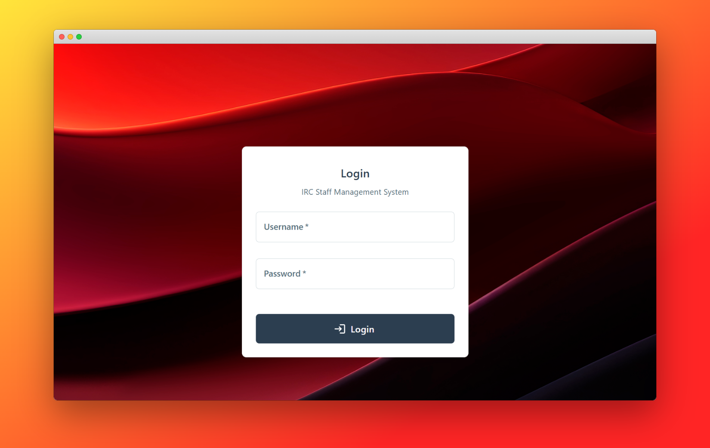
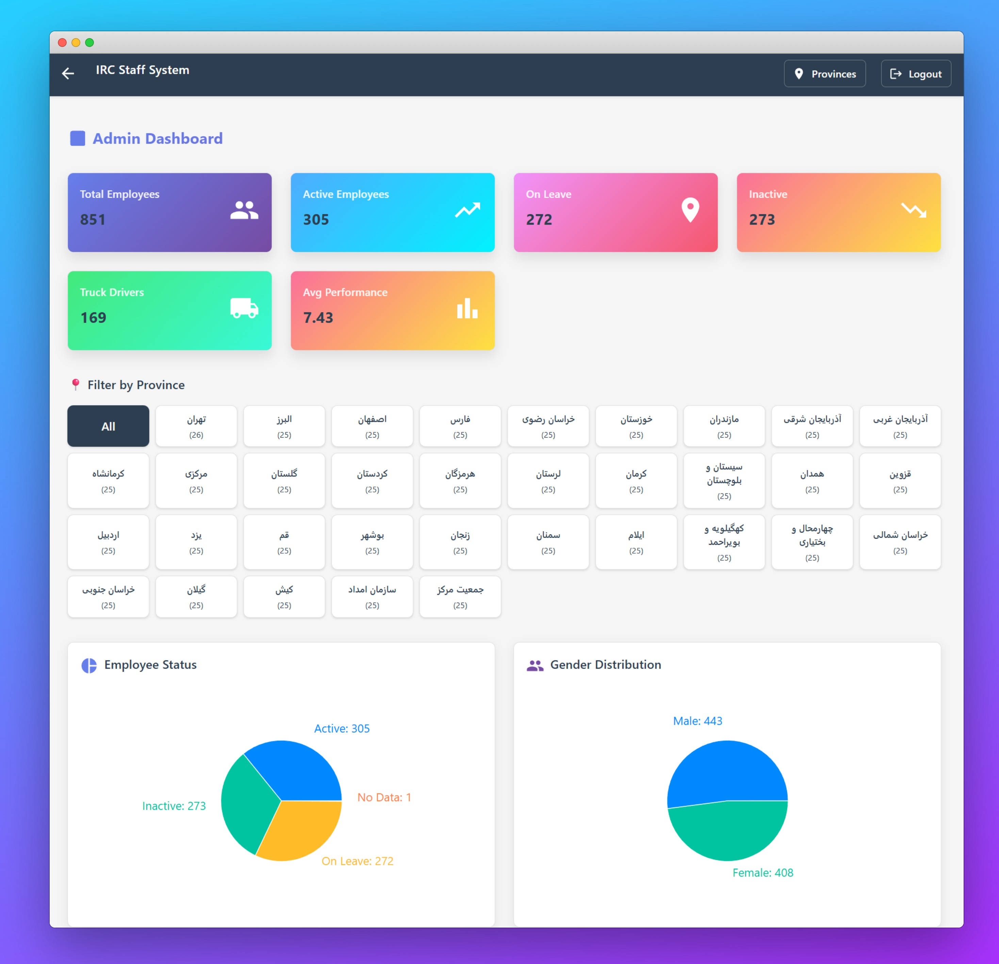
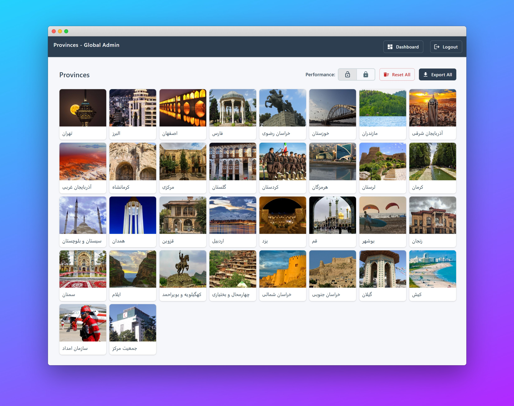
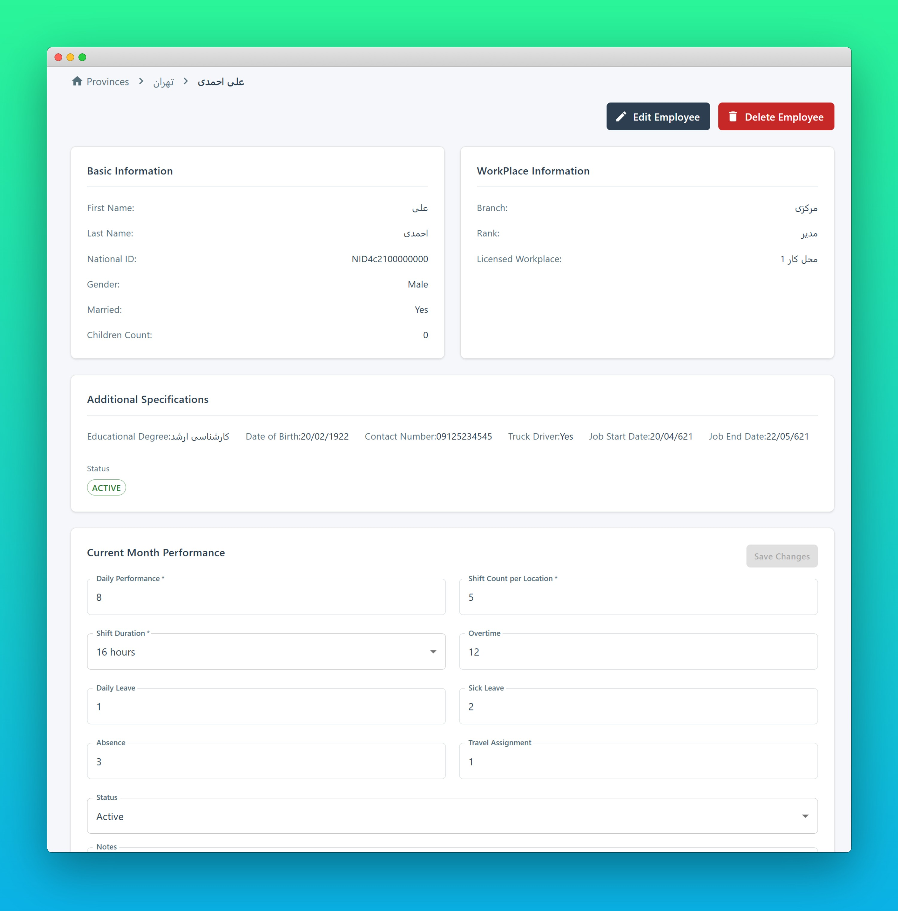

# IRC Employee Management System

Role-based staff management for organizations with one global administrator and province-scoped administrators. The app is split into a React client and an Express + MongoDB server, with session-based authentication and province-scoped employee management.

---

## Screenshots

Below are some screenshots of the IRC Employee Management System in action:

<div align="center">

<b>Login Page</b><br>


<b>Global Admin Dashboard</b><br>


<b>Province List</b><br>


<b>Province Dashboard</b><br>


<b>Employee List</b><br>


<b>Employee Details</b><br>


<b>Edit Employee Dialog</b><br>


<b>New Employee Form</b><br>


<b>Performance Lock Warning</b><br>


</div>

## Repository Layout

```text
.
├── client/                 # React + Vite front end
│   ├── src/
│   ├── public/
│   └── package.json
├── server/                 # Express + Mongoose back end
│   ├── src/
│   ├── jest.config.js
│   └── package.json
├── PERFORMANCE_LOCK_*.md   # notes for the lock feature
├── routing.md              # API routing notes
└── README.md
```

## Tech Stack

**Backend**

- Node.js + Express + TypeScript
- MongoDB via Mongoose
- `express-session` + `connect-mongo`
- Jest + Supertest
- ExcelJS export utilities

**Frontend**

- React 19 + TypeScript + Vite
- React Router 7
- MUI 7 (`@mui/material`, `@mui/x-data-grid`)
- Axios
- Recharts

## Current Features

- Login and logout with cookie-backed sessions
- Global admin province dashboard
- Province-scoped employee CRUD
- Employee detail page with edit dialogs
- Performance record management
- Global performance lock toggle
- Reset all performance metrics
- Province Excel export and global Excel export
- Admin dashboard statistics endpoint and charts UI
- Province image serving from the backend

## Roles

- `globalAdmin` - can access all provinces, employees, exports, and global settings
- `provinceAdmin` - can manage employees only inside the assigned province

## Getting Started

### Prerequisites

- Node.js 18+
- pnpm
- MongoDB instance

### Install

Install each package from its own directory:

```sh
cd server
pnpm install

cd ../client
pnpm install
```

### Server environment

Create `server/.env` with at least:

```env
PORT=3000
MONGODB_URI=mongodb://localhost:27017/ircdb
SESSION_SECRET=super-secret
CORS_ORIGIN=http://localhost:5173
```

The server reads configuration from `server/src/config/index.ts`.

### Client environment

Optional `client/.env`:

```env
VITE_API_BASE_URL=http://localhost:3000
```

If unset, the client defaults to `http://localhost:3000`.

### Run the server

```sh
cd server
pnpm dev
```

The API listens on `http://localhost:3000` by default.

### Run the client

```sh
cd client
pnpm dev
```

Open the Vite URL shown in the terminal, typically `http://localhost:5173`.

## API Overview

### Auth

| Method | Endpoint | Description |
| --- | --- | --- |
| POST | `/auth/login` | Authenticate and create a session |
| POST | `/auth/logout` | Destroy the current session |

### Provinces

| Method | Endpoint | Description |
| --- | --- | --- |
| GET | `/provinces` | List provinces for global admins |
| GET | `/provinces/:provinceId` | Get one province |

### Employees

| Method | Endpoint | Description |
| --- | --- | --- |
| GET | `/provinces/:provinceId/employees` | List employees with pagination |
| GET | `/provinces/:provinceId/employees/export-excel` | Export one province to Excel |
| POST | `/provinces/:provinceId/employees` | Create an employee |
| GET | `/provinces/:provinceId/employees/:employeeId` | Fetch one employee |
| PUT | `/provinces/:provinceId/employees/:employeeId` | Update an employee |
| DELETE | `/provinces/:provinceId/employees/:employeeId` | Delete an employee |

### Global employee actions

| Method | Endpoint | Description |
| --- | --- | --- |
| GET | `/employees/export-all` | Export all employees to Excel |
| DELETE | `/employees/clear-performances` | Reset performance data globally |

### Global settings

| Method | Endpoint | Description |
| --- | --- | --- |
| GET | `/global-settings` | Read the performance lock status |
| POST | `/global-settings/toggle-performance-lock` | Toggle the performance lock |

### Misc

| Method | Endpoint | Description |
| --- | --- | --- |
| GET | `/admin-dashboard/stats` | Global admin dashboard metrics |
| GET | `/health` | Health check |
| GET | `/api-docs` | API docs entry point |

## Frontend Flow

1. Users land on `/` and submit credentials.
2. `globalAdmin` users are redirected to `/provinces`.
3. `provinceAdmin` users are redirected to `/provinces/:provinceId/employees`.
4. Authenticated pages are wrapped in `client/src/components/ProtectedRoute.tsx`.
5. Route pages are lazy-loaded from `client/src/App.tsx`.

## Testing

### Server

```sh
cd server
pnpm test
```

Backend tests live in `server/src/__tests__/`.

### Client

The client currently has linting configured but no automated test suite:

```sh
cd client
pnpm lint
```

## Notes

- Province images are served from `server/src/img` under `/img`.
- The performance lock blocks employee update operations and global performance resets.
- Some supplemental markdown files are design notes rather than guaranteed source-of-truth docs; prefer the route and config files when behavior differs.

## Additional Documentation

- `client/CLIENT_README.md`
- `client/IMPLEMENTATION.md`
- `routing.md`
- `PERFORMANCE_LOCK_FEATURE.md`
- `server/TEST_SETUP.md`
